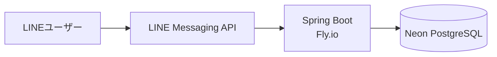

# 認知症介護 症状記録アプリ「介護のきろく」（LINE Bot） 
# care-symptom-logger
認知症介護におけるご家族の「日々の症状記録」の負担を極限まで下げるために開発した、選択式特化型のLINE Botです。文字入力を極力排除し、スマホから数タップで状態を記録・蓄積できるUI/UXを実現しています。

## 📱 動作デモ


## 🤖 実際に触ってみる


以下のQRコードをスマホのカメラで読み込むと、実際のBotをお試しいただけます。

> **⚠️ テスト利用に関するお願い**
> * 本Botはポートフォリオおよび実証実験用として稼働しています。個人情報等は入力しないようお願いいたします。
> * インフラのコスト削減のため、一定時間アクセスがないとデータベースがスリープします。**初回操作時のみ、DB起動のため応答までに10〜30秒ほどかかる場合**があります。

## 開発過程の記事
Zennにて開発過程を公開しております。順次記事は追加していく予定です。
[はてぶ1000ブクマの介護記事を書いたSEが学んだ設計思想](https://zenn.dev/horino_a/articles/6d98763c43e3e4)
[追い詰められた介護者のための画面遷移設計](https://zenn.dev/horino_a/articles/84a9e741a88220)
[OOM Killerと戦ったちいかわSEがせんべろ（512MB）で討伐した話〜Fly.io + Neon本番デプロイ〜](https://zenn.dev/horino_a/articles/35017b212a13f0)

## 🛠 使用技術・インフラ構成
* **Backend:** Java 21 / Spring Boot 4.x / LINE Messaging API (Java SDK)
* **Database:** Neon (Serverless Postgres)
* **Infrastructure:** Fly.io

## 💡 アーキテクチャの考え方（コスト最小限・高可用性設計）
個人開発におけるランニングコストを最小化しつつ、実用的なレスポンスを維持するためのインフラ設計を行っています。

1. **LINE APIの完全無料運用**
   ユーザーの「リッチメニューのタップ（Webhookイベント）」をトリガーとしたリプライAPIのみで設計。プッシュメッセージAPIを排除することで、LINE側の月間配信数制限（無料枠200通/月）に一切縛られない完全無料の運用を実現。
2. **インフラ費用の最適化（ハーフ・コールドスタート設計）**
   Webサーバー（Fly.io）は常時起動させてリクエストの取りこぼしを防ぎつつ、DB（Neon）はアクセスがないと自動スリープする構成を採用。これにより、月額約1000円（Fly.ioの最小リソース分）のみで24時間稼働のBotシステムを構築。
3. **セキュリティとDB保護**
   LINE公式SDKの `@LineMessageHandler` による署名検証をController層の入り口で実施。不正なアクセスをDB接続前に弾き返すことで、悪意のあるアクセスによるNeonの無料枠（コンピュート時間の枯渇を防止。また、CSVダウンロード用URLにはJWT（JSON Web Token）による暗号化と有効期限（10分間）を設定し、トークン検証を行うことで、第三者による不正なデータ抽出やURLの使い回しをガードしています。

## 1. プロジェクトの背景と目的

### 1.1 背景
認知症の家族を介護する際、医療機関やケアマネージャー等への「正確な症状の共有」が適切なケアプラン作成・医療保護入院などの手続きにおいて不可欠となる。しかし、パニック状態や疲労困憊にある家族が、初対面の専門家に対して客観的かつ時系列に沿った事象の説明を行うことは極めて困難である。
本プロジェクトは、システム開発における「バグ報告・ログ設計」の知見を応用し、ITリテラシーが高くない一般の介護者でも、日常の「ファクト（5W1H）」を容易に記録・蓄積できる仕組みを提供するものである。

### 1.2 目的
* **介護者の負担軽減:** 専門家への説明という高いハードルを、日々の「問答無用ぽちぽち」入力によるログ蓄積で代替する。
* **専門家への「トリガー」提供:** 完璧な定性データではなく、医療・介護の専門家が的確なヒアリングを行うための「客観的な事実データ（発生頻度・状況）」を提供する。
* **介護者のためのログ基盤:** 家族・病院・ケアマネ・地域包括支援センターなど多彩なユーザーをつなぐログ基盤

## 2. なぜ作るのか
父の認知症介護で、「いつ、どんな症状が起きたか」を医師や地域包括支援センターに正確に伝えることが非常に困難でした。
私はGoogleドキュメントで日付ごとに記録し、メール・QRコード・FAXで共有する運用を続けましたが、もっと簡単に「ファクト」を残せる仕組みが必要だと感じました。
ソフトウェア開発のログ設計の考え方を介護に応用し、LINE Botとして実装しています。

## 3. 機能要件

### 3.1 症状記録入力（LINE対話UI）
LINEのトークルームにて、ボットとの対話（クイックリプライ・カルーセル）を通じて以下の項目を記録する。
* **発症日時:** (必須) デフォルトは現在時刻、過去指定も可能。
* **発症者・対象者:** (必須) 家系図からタップで選択。
* **症状名カテゴリ:** (必須) 「困った」「記憶と言葉」「行動」「見当」の4カテゴリから具体的な症状をタップで選択。
* **メモ:** (任意) 256文字以内のフリーテキスト。

### 3.2 記録一覧
* リッチメニューからFLEX MASSEGEにて、日付降順・発症者・症状別の直近１ヶ月リスト表示を提供する。

### 3.3 記録のエクスポート（共有機能）
* 専門家との面談用資料作成のため、直近３ヶ月の症例を「CSV出力」にて生成する。
* 生成されたデータは、ダウンロードされ、メールで送信したり書類作成に使用していただく。

## 4. データモデル設計（ER図）

```mermaid
erDiagram
  symptonCategry ||--|{symptom  : "1の症状分類は複数の症状項目をもつ"
  peopleCare {
    integer id PK
    string relationship "続柄"
    boolean whoCheck "(誰が)選択時表示"
  }
  symptom {
    integer id PK
    integer symptonCatId FK
    string symptomItem "症状項目"
  }
  symptonCategry {
    integer id PK
    string symptonCatName "症状分類名"
  }
  feeling {
    integer id PK
    string emotionalname "説明"
  }
  
  registrant {
    bigint id PK "LINE_UserID(ハッシュ)"
    string eMail 
  }
  
  symptomArticle {
    bigint id PK
    bigint registrantId FK "登録者ID"
    datetime onsetTime "発症日時"
    integer whoIs FK "誰が(peopleCare)"
    integer toWho FK "誰に(peopleCare)"
    integer evaluation "評価(ランク)"
    integer feeling FK "感情"
    string memo "メモ"
  }
  symptomRec {
    bigint id PK
    bigint symptomArticleID FK
    integer symptomID FK
  }

  symptompeoplecare {
    bigint id PK
    bigint registrantId PK "登録者ID"
    integer peoplecreid
    boolean whoIscheck
    boolean toWhocheckß
    integer sortorder
  }
  
  symptomArticle ||--o{symptomRec  : "1の症状記事は0or複数の症状記録をもつ"
  symptomArticle ||--o{feeling  : "1の症状記事は0or複数のfeeling（感情）をもつ"
  symptomArticle ||--|| symptompeoplecare : "1の登録者は1登録者IDを持つ"
  registrant ||--o{symptomArticle :"1の登録者は0または複数の症状記事を持つ"
  symptom ||--|{symptomRec  : "1の症状項目は複数の症状記録をもつ"
