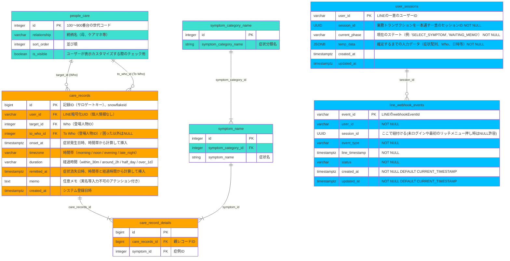

```mermaid
erDiagram
%% --- マスタ面 ---
    symptom_name:::core {
        integer id PK
        integer symptom_category_id FK
        string symptom_name "症状名"
    }

    symptom_category_name:::core {
        integer id PK
        string symptom_category_name "症状分類名"
    }

    people_care:::core {
        integer id PK "100〜900番台の世代コード"
        varchar relationship "続柄名（母、ケアマネ等）"
        integer sort_order "並び順"
        boolean is_visible "ユーザーが表示カスタマイズする際のチェック用"
    }

%% --- トランザクション（ファクト）面 ---
    care_records:::event {
        bigint id PK "記録ID（サロゲートキー）、snowflakeid"
        varchar user_id FK "LINE暗号化UID（個人情報なし）"
        integer target_id FK "Who（登場人物ID）"
        integer to_who_id FK "To Who（登場人物ID）/ 困った以外はNULL"
        timestamptz onset_at "症状発生日時、時間帯から計算して挿入"
        varchar timezone "時間帯（morning / noon / evening / late_night）"
        varchar duration "経過時間（within_30m / around_2h / half_day / over_1d）"
        timestamptz remitted_at "症状消失日時、時間帯と経過時間から計算して挿入"
        text memo "任意メモ（実名等入力不可のアテンション付き）"
        timestamptz created_at "システム登録日時"
    }

    care_record_details:::event {
        bigint id PK
        bigint care_records_id FK "親レコードID"
        integer symptom_id FK "症例ID"
    }

%% --- アプリ管理（ステート）面 ---
    user_sessions:::session {
        varchar user_id PK "LINEの一意のユーザーID"
        UUID session_id "業務トランザクションを一本通す一意のセッションID NOT NULL"
        varchar current_phase "現在のステート（例: 'SELECT_SYMPTOM', 'WAITING_MEMO'） NOT NULL"
        JSONB temp_data "確定するまでの入力データ（症状配列、Who、日時等）NOT NULL"
        timestamptz created_at 
        timestamptz updated_at 
    }

    line_webhook_events:::session {
        varchar event_id PK "LINEのwebhookEventId"
        varchar user_id "NOT NULL"
        UUID session_id "ここで紐付ける(未ログインや最初のリッチメニュー押し時はNULL許容)"
        varchar event_type "NOT NULL"
        timestamptz line_timestamp "NOT NULL"
        varchar status "NOT NULL"
        timestamptz created_at "NOT NULL DEFAULT CURRENT_TIMESTAMP"
        timestamptz updated_at "NOT NULL DEFAULT CURRENT_TIMESTAMP"
    }
    
    symptom_category_name ||--|{ symptom_name : symptom_category_id
    care_records ||--|{ care_record_details : care_records_id
    symptom_name ||--|{ care_record_details : symptom_id
    people_care ||--o{ care_records : "target_id (Who)"
    people_care ||--o{ care_records : "to_who_id (To Who)"
    user_sessions ||--o{ line_webhook_events : session_id

    classDef core fill:#40E0D0
    classDef event fill:#FFA500
    classDef session fill:#00BFFF

```