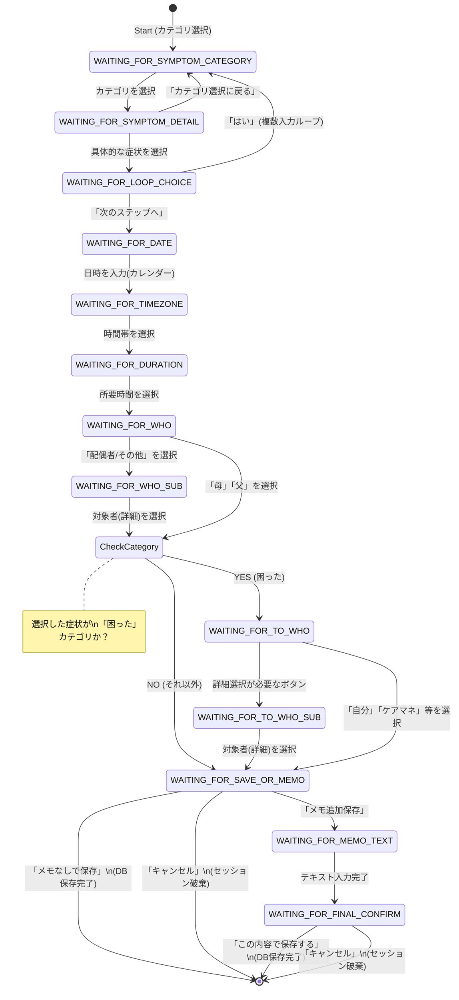

# 介護記録入力 全体ステートマシン＆Postbackデータ設計

## 全体フロー図

## Postbackの `data` フォーマット（設計書）

JSONの `data` 部は、Java側で `action=○○` というキーで分岐できるように、以下の命名規則で統一する。

| 現在のInputPhase | ユーザーの操作（Flex Message） | FLEXjson名 | 送信する `data` の形式 | 次のInputPhase |
| :--- | :--- | :--- | :--- | :--- |
| **WAITING_FOR_SYMPTOM_CATEGORY** | 「困った」「記憶と行動」等を選択 | SymptomCategoryName.json |`action=select_symptom_category&categoryId=30` | **WAITING_FOR_SYMPTOM_DETAIL** |
| **WAITING_FOR_SYMPTOM_DETAIL** | 「同じことを何度も聞く」等を選択 | switch categoryId case 30: Sympton_Trouble.json case 40: Symptom_MemoryWord.json case 50: Sympton_Behavior.json case 60: Sympton_Mistake.json |`action=select_symptom_detail&categoryId=30&symptomId=3011` | **WAITING_FOR_LOOP_CHOICE** |
| **WAITING_FOR_SYMPTOM_DETAIL** | 「カテゴリ選択に戻る」を選択 | 同上内 |`action=back_to_category` | **WAITING_FOR_SYMPTOM_CATEGORY** |
| **WAITING_FOR_LOOP_CHOICE** | 「はい（続けて入力）」を選択 | SymptomYN.json | `action=continue_symptom` | **WAITING_FOR_SYMPTOM_CATEGORY** |
| **WAITING_FOR_LOOP_CHOICE** | 「次のステップへ」を選択 | SymptomYN.json | `action=next_to_date` | **WAITING_FOR_DATE** |
| **WAITING_FOR_DATE** | カレンダーで日時を選択 | Calender.json | `action=select_date`  *(※日付は `params` 等の別フィールドに入る想定)* | **WAITING_FOR_TIMEZONE** |
| **WAITING_FOR_TIMEZONE** | 「朝」「昼」等を選択 | Timezone.json | `action=select_timezone&code=morning` | **WAITING_FOR_DURATION** |
| **WAITING_FOR_DURATION** | 「30分まで」等を選択 | TimeSpend.json | `action=select_duration&id=1` | **WAITING_FOR_WHO** |
| **WAITING_FOR_WHO** | 「母」「父」等を選択 | Whois.json | `action=select_who&id=1` | **WAITING_FOR_TO_WHO** (※1) または **WAITING_FOR_SAVE_OR_MEMO** |
| **WAITING_FOR_WHO** | 「配偶者/その他」を選択 | Whois.json | `action=show_who_sub` | **WAITING_FOR_WHO_SUB** |
| **WAITING_FOR_WHO_SUB** | 「義母」「祖父」等を選択 | WhoisOther.json |`action=select_who_detail&id=11` | **WAITING_FOR_TO_WHO** (※1) または **WAITING_FOR_SAVE_OR_MEMO** |
| **WAITING_FOR_TO_WHO** | 「自分（介護者）」等を選択 | ToWho.json | `action=select_to_who&id=1` | **WAITING_FOR_SAVE_OR_MEMO** |
| **WAITING_FOR_TO_WHO** | サブメニューを開くボタンを選択 | ToWho.json | `action=show_to_who_sub` | **WAITING_FOR_TO_WHO_SUB** |
| **WAITING_FOR_TO_WHO_SUB** | 「ケアマネ」「医師」等を選択 | ToWhoOther.json | `action=select_to_who_detail&id=11` | **WAITING_FOR_SAVE_OR_MEMO** |
| **WAITING_FOR_SAVE_OR_MEMO** | 「メモなしで保存」を選択 | MemoYN.json | `action=save_no_memo` | **（完了・DB保存）** |
| **WAITING_FOR_SAVE_OR_MEMO** | 「メモ追加保存」を選択 | MemoYN.json |  `action=want_memo` | **WAITING_FOR_MEMO_TEXT** |
| **WAITING_FOR_SAVE_OR_MEMO** | 「キャンセルしてメニューに戻る」を選択 | MemoYN.json | `action=cancel_record` | **（セッション破棄・Startへ）** |
| **WAITING_FOR_MEMO_TEXT** | （キーボードで文字入力） | テキスト入力 |*(Postbackではなく通常テキストイベント)* | **WAITING_FOR_FINAL_CONFIRM** |
| **WAITING_FOR_FINAL_CONFIRM** | 「この内容で保存する」を選択 | MemoAddYN.json | `action=save_final` | **（完了・DB保存）** |
| **WAITING_FOR_FINAL_CONFIRM** | 「キャンセルしてメニューに戻る」を選択 | MemoAddYN.json | `action=cancel_record` | **（セッション破棄・Startへ）** |

*(※1) 選択した症状のカテゴリが「困った」の場合は `WAITING_FOR_TO_WHO` へ、それ以外の場合は `WAITING_FOR_SAVE_OR_MEMO` へ分岐する。*