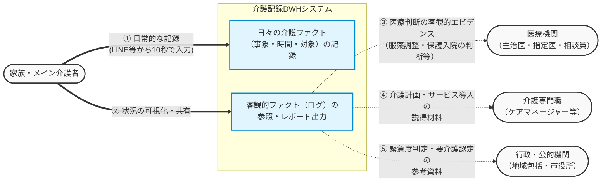

# 要件定義書
## 概要
家族に認知症がある介護者が（以下ユーザー）症状のファクトを問答無用ぽちぽちでLINEbotから投稿し保存できる。

## 1. プロジェクトの背景と目的

### 1.1 背景
認知症の家族を介護する際、医療機関やケアマネージャー等への「正確な症状の共有」が適切なケアプラン作成・医療保護入院などの手続きにおいて不可欠となる。しかし、パニック状態や疲労困憊にある家族が、初対面の専門家に対して客観的かつ時系列に沿った事象の説明を行うことは極めて困難である。
本プロジェクトは、システム開発における「バグ報告・ログ設計」の知見を応用し、ITリテラシーが高くない一般の介護者でも、日常の「ファクト（5W1H）」を容易に記録・蓄積できる仕組みを提供するものである。

### 1.2 目的
* **介護者の負担軽減:** 専門家への説明という高いハードルを、日々の「問答無用ぽちぽち」入力によるログ蓄積で代替する。
* **専門家への「トリガー」提供:** 完璧な定性データではなく、医療・介護の専門家が的確なヒアリングを行うための「客観的な事実データ（発生頻度・状況）」を提供する。
* **介護者のためのログ基盤:** 家族・病院・ケアマネ・地域包括支援センターなど多彩なユーザーをつなぐログ基盤

## 2. コアコンセプト（設計思想）

### 2.1 Privacy by Design（個人情報を保持しない設計）
取り扱うデータが「要配慮個人情報（PHI）」に該当し得る性質を持つため、システム側では**「個人を特定できる情報（氏名・住所など）」を一切保持しないアーキテクチャ**を採用する。
* 登場人物はすべて「家系図（続柄：おじいちゃん、おばあちゃん等）」のアイコンとして管理。
* 万が一データが流出しても、「どこかの誰かのおじいちゃんが徘徊した」という匿名のログにしかならない状態を担保する。

### 2.2 「ファクト」への特化と定性データの割り切り
追い詰められた家族に詳細な状況（定性データ）の記録を求めるのはUXとして破綻する。そのため、記録項目は極力選択式（カルーセル等）とし、確実な「5W1H」の取得に特化する。詳細な文脈の深掘りは、出力されたログを元にした専門家の直接ヒアリングに委ねる。

## 3. アーキテクチャのトレードオフ判断

本システムの設計において、以下のビジネス的・システム的制約に基づきシビアなトレードオフ判断を行っている。

1. **ネイティブアプリではなく「LINE Bot」を採用**
   * *理由:* ターゲットユーザーのITリテラシーと精神的余裕を考慮すると、「アプリのインストールとアカウント作成」は致命的な離脱ポイントとなる。プラットフォーム（LINE）への依存リスクを承知の上で、導入の心理的ハードルを極限まで下げることを優先した。
2. **B2Bシステム連携の非採用（テキスト/CSV出力への割り切り）**
   * *理由:* 個人情報保護が厳しく、ビジネスチャットすら普及していない介護医療業界のレガシーな現状を鑑み、既存の電子カルテシステム等へのAPI連携スコープはオーバースペック（ビジネスとして成立しない）と判断。MVPとして「整形されたテキスト・CSVをメール等で出力し、ユーザー自身が窓口に提出する」最も泥臭いが確実なアナログ連携を採用する。

## 4. 機能要件

### 4.1 症状記録入力（LINE対話UI）
LINEのトークルームにて、ボットとの対話（クイックリプライ・カルーセル）を通じて以下の項目を記録する。
* **発症日:** (必須) デフォルトは現在時刻、過去指定も可能。
* **発症時間帯**(必須)
- 朝 (MORNING)
- 昼 (NOON)
- 夕方 (EVENING)
- 夜・深夜 (NIGHT)
* **経過時間**(必須)
##### 経過時間
- 「30分まで」 (Within 30 Minutes / `UP_TO_30_MIN`)
- 「2時間程度」 (Around 2 Hours / `AROUND_2_HOURS`)
- 「半日」 (Half Day / `HALF_DAY`)
- 「1日以上」 (1 Day or More / `OVER_1_DAY`)
* **発症者・対象者:** (必須) 登場人物フォームからタップで選択。
- 対象者は家系図アイコン以外にも登場人物がいるため、下記のアイコンを追加する。
「医療従事者(医師・看護師)"」「介護施設スタッフ」「ケアマネージャー」「その他の方」
* **症状名カテゴリ:** (必須) 「困った」「記憶と言葉」「行動」「見当」の4カテゴリから具体的な症状をタップで選択。
- 認知症には
    中核症状：病気の主な症状、記憶力の低下、判断力や抽象的な考え方の低下
    周辺症状：上記の症状が元となって、行動や心理症状に現れるもの
がある。素人目には判断がつきにくいため医療者や介護者が知りたいカテゴリに沿って厳密に分けずに記載する。
https://info.ninchisho.net/symptom
- ユーザーは症状名を以下４つのカテゴリに分けられたタグorリストをタップすることで、なるべく簡易に症状名を入力できるようにする。
- 下記9項目まで入力可能。
##### 困った
- 「暴言や暴力を振るう」
- 「異常な回数や内容 of 電話や手紙」
- 「警察や市役所に無断連絡」
- 「詐欺の被害に遭う」
- 「徘徊する」
- 「物が盗まれたと誤解する」
- 「食べ物以外のものを食べる」
- 「便の処理が不適切」
- 「性的な行動をとる」

##### 記憶と言葉
- 「同じことを何度も聞く」
- 「約束を忘れる」
- 「頻繁に探し物をしている」
- 「食事したこと自体を忘れる」
- 「同じものを何度も買う」
- 「過去の経歴を思い出せない」
- 「家族の顔や名前がわからない」
- 「会話で『あれ・それ』が増えた」
- 「言葉が出ない・迷いながら話す」
- 「話のつじつまが合わない」
- 「相手の言葉を理解できない」
- 「作り話や嘘が増えた」

##### 行動
- 「家事がうまくできない」
- 「服をうまく着られない」
- 「食事や薬をこぼす・落とす」
- 「トイレや風呂掃除が雑」
- 「外出が極端に減った」
- 「寝不足で疲れている」
- 「ゴミを捨てない・溜める」
- 「お風呂に入りたがらない」
- 「食事や薬を拒否する」
- 「すぐに家に帰りたがる」
- 「詐欺に引っかかる」
- 「物を盗む（万引き等）」

##### 勘違い・迷い
- 「日付がわからない」
- 「時計が読めない`
- 「朝と夜の区別がつかない」
- 「季節に合わない服を着る」
- 「よく物にぶつかる」
- 「同じ場所をうろうろする」
- 「トイレや風呂の場所を間違える」
- 「極端に暑がる・寒がる・かゆがる」
- 「家の近所で迷う`
- 「外出して帰れなくなる」
- 「今いる場所がわからない」
- 「家族や友人を間違える」
- 「いない人が見える・声が聞こえる」

* **メモ:** (任意) 256文字以内のフリーテキスト。

##### 画面遷移およびデータ入力フロー
ユーザーの入力負荷を極限まで削りつつ、DWH（データウェアハウス）での高度なクロス集計に耐えうる粒度のデータを「個人情報を一切保持せず（Privacy by Design）」に取得するため、以下の「症例ファースト」および「コンテキスト駆動型条件分岐」を採用する。

###### 【全体の画面遷移フロー】
1. **[2×2緑] ➡️ 症状大カテゴリ選択（2×2緑）**
   - 選択肢: 🆘 困った / 💭 記憶と言葉 / 💥 行動 / 🌀 勘違い・迷い
2. **[具体的な症例選択] ➡️ 縦並び白リスト**
   - ユーザーの「今起きた！」という衝動を最優先で受け止める。
   - ここで `categoryId`（1〜4）および `symptomId` が確定する。
3. **[対象者（Who）] ➡️ 2×2緑（変則3ボタン）**
   - 初期値として `202: 母` / `201: 父` / `899: 配偶者/その他` を表示（リッチメニューから動的カスタマイズ可能）。
4. **[対象（To Who）] ➡️ 2×2緑（★条件分岐）**
   - **発火条件**: `categoryId == 1`（🆘 困った）の場合のみこの画面を差しさむ。
   - 衝突の起きやすい `301: 本人（介護者）` / `901: ケアマネ` / `903: 施設スタッフ` / `999: その他` を配置。
   - **スキップ条件**: `categoryId` が `2, 3, 4` の場合はこの画面を**完全スキップ**し、システム側で一律 `to_who_id = 999`（その他/なし）を自動補完する。
5. **[日付入力] ➡️ カレンダー表示ボタン（LINE datetimepicker）**
   - `mode: "date"`（月・日のみの2列ドラムロール）で負荷を最小化。デフォルト値は「今日」。
6. **[時間帯選択] ➡️ 2×2緑**
   - 選択肢: 朝 / 昼 / 夕方 / 夜・深夜（ late_night の過酷さを可視化）
7. **[経過時間選択] ➡️ 2×2緑**
   - 選択肢: 30分まで / 2時間程度 / 半日 / 1日以上
8. **[データ確定] ➡️ Spring Bootバックエンド経由でPostgreSQL（DWH）へ格納**

---

###### 登場人物マスター（master.peoplecare）の採番規則（参考）
IDの範囲（番台）だけでジェノグラムの世代および外部プロ陣を判定できる、整数除算（`id / 100`）に最適化したコード設計とする。

| ID範囲 | 区分 | 対象（例） |
| :--- | :--- | :--- |
| **100番台** | 祖父母世代 | 祖父、祖母、義祖父、義祖母 |
| **200番台** | 父母世代 | 父、母（whocheck=t）、義父、義母、叔父、叔母 |
| **300番台** | 本人・同世代 | 本人（介護者/whocheck=t）、夫、妻、兄弟姉妹 |
| **400番台** | 子世代 | 息子（兄・弟）、娘（姉・妹） |
| **500番台** | 孫世代 | 孫（男）、孫（女） |
| **900番台** | 他人（外部プロ） | ケアマネ、施設スタッフ、医師、看護師、その他 |

### 4.2 データの不変性（Immutable Data）とCRUD操作の制限
本DWH（データウェアハウス）システムにおける介護記録データは、**「Create（追記）」と「Read（参照）」のみ**を許可する。原則として、システム上からの**「Update（更新）」および「Delete（物理削除）」機能は実装しない**。

#### 理由（Why）
1. **ファクト（事実）の不変性担保**
   DWHの設計原則に従い、発生した事象（「いつ」「誰が」「どのような行動をしたか」）は覆らない歴史の事実として扱う。データを後から上書き可能にすることは、SSOT（単一の真実の情報源）としての信頼性を損なうため。
2. **エビデンス（証拠能力）の確保**
   本システムの出力レポートは、医療機関（医師の診断・医療保護入院の判断）や行政（要介護認定）、ケアマネージャーへの提出資料として使用される。そのため、「都合の悪い記録を後から消去・改ざんできない」というシステム的制約そのものが、レポートの客観的な証拠能力を担保する最強の武器となる。

#### 誤入力時の運用回避策
ユーザーがLINE上で誤ったボタンを押下して記録してしまった場合は、以下の運用で対応する。
* **現状のフェーズ:** 誤入力であることを示す「訂正の記録」を新しく追記（Append）する（会計システムの訂正仕訳と同等のアプローチ）。
* **将来のフェーズ:** 管理者用Webダッシュボード実装時に、「論理削除（`is_deleted = true` フラグの付与）」機能のみを追加要件として検討する。物理削除は将来にわたって許可しない。

### 4.3 記録一覧・検索
* トークルームを遡る形での確認のほか、リッチメニューから「最近の様子を出す」押下で、直近１ヶ月の症状記DBから抽出し記事から発症日時、症例カテゴリー、症状名、発症者、対象者を抜き出した要素を発症日時降順に並べた一覧表示をFLEX_MASSEAGEにて行う。

### 4.4 記録のエクスポート（共有機能）
* 専門家との面談用資料作成のため、発祥日時直近３ヶ月「症状記録テキスト出力」または「CSV出力」を生成する。メモリ枯渇（OOM）回避対策も兼ねている。
* 生成されたデータは、ダウンロードリンクとして提供する。

### 4.3,4.4にて日付指定条件を省いた理由
* 認知負荷の最小化: 疲れた介護者の方が「どうやって期間を選ぼう？」と迷う時間をゼロにする。
* 専門家が介護者より欲しいデータの最小公倍数: 医師やケアマネが判断材料として欲しがるのは、大体「直近の継続的な様子」なので、1~3ヶ月あれば十分判断材料になる。
* 長期的なデータの出力は次の課題: １年以上の症例データは医師の投薬による効果の確認やケアマネージャの介護計画作成にためなど、主にプロ側のためのデータのため、今回の仕様からは外す。

### 4.5 相談フロー・ヘルプ機能(2026/07時点未実装)
* 医療や介護への相談方法がわからないユーザーのため、適切な相談先（地域包括支援センター等）へ繋がるための案内フローを提供する。

## 5. セッション管理および冪等性制御詳細設計

### 5.1. 概要
LINE Messaging APIにおけるステートレス（状態を持たない）なWebhook通信において、ユーザーの入力開始（Start）から保存（END）までの一連の業務トランザクションを一意に識別・制御するため、システム固有の **「セッションID（UUID）」** を一本通すアーキテクチャを採用する。

これにより、LINEプラットフォーム特有の「5秒リトライルール」による多重投稿を防ぎ、電波状況等によるイベントの順序逆転（レースコンディション）が発生しても、DWH側のデータ（`core` / `event` スキーマ）の整合性を100%担保する。

---

### 5.2. データベース物理設計（`session` スキーマ）

セッション管理およびWebhookのログ制御は、データ分析領域（DWH）とは明確に分離するため、専用の `session` スキーマ内に集約する。

#### 5.2.1. ユーザーセッション管理テーブル（`session.user_sessions`）
1ユーザーあたり常に最大1件のアクティブな入力セッション状態を保持する。

```sql
CREATE TABLE session.user_sessions (
    user_id VARCHAR(255) PRIMARY KEY,       -- LINEの一意のユーザーID
    session_id UUID NOT NULL,               -- 業務トランザクションを一本通す一意のセッションID
    current_phase VARCHAR(50) NOT NULL,     -- 現在のステート（例: 'SELECT_SYMPTOM', 'WAITING_MEMO'）
    temp_data JSONB NOT NULL,               -- 確定するまでの入力データ（症状配列、Who、日時等）
    created_at TIMESTAMPTZ NOT NULL DEFAULT CURRENT_TIMESTAMP,
    updated_at TIMESTAMPTZ NOT NULL DEFAULT CURRENT_TIMESTAMP
);

```
#### 5.2.2. LINE Webhookログテーブル（session.line_webhook_events）
LINEから到達したすべてのイベントをインサートし、DBの主キー制約を利用して二重処理を水際で防ぐ（冪等性の担保）。
```sql
CREATE TABLE session.line_webhook_events (
    event_id VARCHAR(255) PRIMARY KEY,      -- LINEの JSON（events[].webhookEventId）
    user_id VARCHAR(255) NOT NULL,          -- LINEのユーザーID
    session_id UUID,                        -- 紐づくセッションID（セッション未生成時はNULL許容）
    event_type VARCHAR(50) NOT NULL,        -- 'message', 'postback' 等の種別
    line_timestamp TIMESTAMPTZ NOT NULL,    -- LINE側でのイベント発生時刻
    status VARCHAR(20) NOT NULL,            -- 'PROCESSING', 'SUCCESS', 'FAILED'
    created_at TIMESTAMPTZ NOT NULL DEFAULT CURRENT_TIMESTAMP,
    updated_at TIMESTAMPTZ NOT NULL DEFAULT CURRENT_TIMESTAMP
);
-- ユーザーごとの履歴検索および最新イベントの順序検証を高速化するインデックス
CREATE INDEX idx_line_webhooks_user_id_time ON session.line_webhook_events(user_id, line_timestamp DESC);
```
### 5.3. セッション・ライフサイクルと制御ロジック
セッションのライフサイクル（開始・更新・終了）は、Java 21（Spring Boot）側で完全にハンドリングし、LINEフロントエンドへ返却する各Flex Messageボタンの postback_data に常に session_id を埋め込むことで状態を維持する。

#### 5.3.1. ライフサイクル三段階フェーズ
##### ① 🏁 セッション開始（大カテゴリ選択時）
1. ユーザーがリッチメニュー等から「最初の症状大カテゴリ」を選択。
2. Webhookを受信した Spring Boot は、新規に java.util.UUID.randomUUID() を発行。
3. session.user_sessions に対し、当該 user_id で UPSERT（既存の未完了セッションがあれば強制上書きパージ）を実行。
4. 次の画面（具体的な症例選択のFlex Message）を組み立てる際、ボタンの postback_data に session_id={UUID} を仕込んで送信。

##### ② 🔄 セッション進捗・ループ（各種ボタン選択時）
1. ユーザーがLINE画面のボタンを押下するたび、postback_data に付与された session_id がバックエンドに還流する。
2. バックエンドは session.user_sessions からレコードを取得し、以下のセキュリティ＆ステートチェックを行う。
3. 検証: 送られてきたsession_id == DBのsession_id であるか？
4. 判定: 一致すれば正当な遷移とみなし、選択されたデータを temp_data（JSONB）へ動的にアペンド（追加）し、current_phase を次のステートに進める。

##### ③ 🔚 セッション終了（データ永続化完了時）
1. 最終確認画面で「保存」が確定（またはメモ入力が完了）した段階で、temp_data からすべての蓄積データを抽出。
2. 分析スキーマ（event.care_records および event.care_record_details）へトランザクションを張り、一括インサート（本保存）を執行。
3. 本保存のコミット成功を確認後、session.user_sessions から当該 user_id のレコードを DELETE（または COMPLETED にステータス変更）し、セッションをクローズする。

### 5.4. Webhookハンドリング疑似コード（Java 21 / Spring Boot）
LINEの「5秒リトライ」による重複パケット、および並列処理での追い越しを制御するバックエンドの中核ロジック。
``` Java
@RestController
@RequestMapping("/webhook/line")
public class LineWebhookController {

    private final WebhookAppService webhookAppService;

    @PostMapping
    public ResponseEntity<Void> handleWebhook(@RequestBody LineWebhookRequest request) {
        for (LineEvent event : request.getEvents()) {
            try {
                // 1. Webhookログへの先行インサート（Status: PROCESSING）
                // ここでPRIMARY KEY（event_id）の衝突が起きれば、一意制約エラーがスローされる
                webhookAppService.logInitialEvent(event);

            } catch (DuplicateKeyException e) {
                // LINEからの5秒ルールによるリトライパケット、またはボタン連打の多重検知
                // LINE側にエラーを返すと再送が激化するため、「何事もなかったかのように」200 OKを即レスする
                log.warn("LINE Webhook重複検知。EventID: {} をスキップします。", event.getWebhookEventId());
                return ResponseEntity.ok().build();
            }

            // 2. 時系列の逆転チェック（追い越し対策）
            if (webhookAppService.isOutdatedEvent(event)) {
                log.warn("遅延パケットを検知。EventID: {} の処理を破棄します。", event.getWebhookEventId());
                webhookAppService.updateEventStatus(event.getWebhookEventId(), "SKIPPED");
                continue;
            }

            // 3. 本戦：セッションIDを用いたステートマシンの駆動
            try {
                webhookAppService.processBusinessLogic(event);
                webhookAppService.updateEventStatus(event.getWebhookEventId(), "SUCCESS");
            } catch (Exception e) {
                log.error("ビジネスロジック処理エラー。EventID: {}", event.getWebhookEventId(), e);
                webhookAppService.updateEventStatus(event.getWebhookEventId(), "FAILED");
                // 必要に応じてユーザーに「システムエラーが発生しました」のLINEメッセージを返却
            }
        }
        return ResponseEntity.ok().build();
    }
}
```

## ユーザーターゲット
認知症の家族を持つが医療や介護の専門知識がない人。

## ユースケース図


## 簡易業務フロー
1. ユーザーは認知症およびその疑いがある人（以下発症者）の様子を観察し、このアプリを使って日々記録を行う。
2. 担当医やケアマネージャー、地域包括センター相談員など（以下専門家）に面談にて相談する際スマホに登録したこのアプリの機能を使って、症状の確認を行なっていただき発症者の症状を確認していただく。
3. 専門家に相談する方法は面談以外にもメール、電話、Faxなど多岐にわたり、かつ相談組織により連絡方法がバラバラのため文書にまとめることが望ましい。このアプリの5.症状記録テキスト出力機能を使用して文書作成していただく。その際
- 患者の過去の医療記録や診断に関する情報、
- 現在の薬のリスト
- 後期高齢者医療保健所番号、介護保険被保険者番号
- 住所、電話番号など連絡先
追加記載する。
（なおビジネスチャットなどとゆう気の利いたものは介護医療業界には存在しない。個人情報保護がものすごくきつい業界である）

## APIエンドポイント設計（HTTPメソッド・リソース対応表）

本システムは、LINEプラットフォームからのWebhook受信を中心とし、DWHの思想に基づきデータの「追記（Create）」と「参照（Read）」に特化したエンドポイント設計とする。
※介護記録データに対する更新（PUT/PATCH）および物理削除（DELETE）機能は提供しない。

| リソース (URI) | HTTPメソッド | 概要（処理内容） | アクター / 用途 |
| :--- | :---: | :--- | :--- |
| `/api/v1/webhook/line` | `POST` | **LINEからのイベント受信**<br>テキストメッセージ、Postbackなどの全トラフィックを受け止め、ステートマシンへ流す（本システムのメイン入力口）。 | LINEプラットフォーム<br>（ユーザー操作） |
| `/api/v1/records/{recordId}` | `GET` | **特定の介護記録の詳細取得**<br>JSONBに格納された詳細データ（症状、対象者、時間帯など）を展開して取得する。 | 管理画面 / 詳細確認用 未開発|
| `/api/v1/records/export` | `GET` | **記録のデータエクスポート（CSV/PDF等）**<br>指定期間のデータを、医療機関や行政に提出できるフォーマットに変換して出力する。 | 家族 / ケアマネ / 行政機関への提出用 |
| `/api/v1/symptoms` | `GET` | **症状マスタ一覧の取得**<br>カテゴリごとに分類された症状一覧を取得する。 | システム内部 / UI描画用 |

## サーバーレス環境候補
### 1. アプリケーション実行環境（Spring Boot）
* **Render (Web Service)**
理由: Dockerfileを置くだけでビルド・デプロイが完了します。無料枠（Free Tier）があり、個人開発には十分です。Git（GitHub）と連携すれば、pushするだけで反映されるので、CLIから爆速開発する陛下との相性は抜群です。
* **Fly.io**
理由: コンテナのデプロイが非常に高速です。世界中にエッジデプロイできるため、レスポンスが極めて速いです。CLIツールが非常に強力なので、Antigravity CLIで操作するような感覚でインフラを管理できるのが最大の魅力です。
### 2. データベース（PostgreSQL）
PostgreSQLを無料で運用する場合、以下のサービスが業界標準です。
* **Neon (Postgres)**
理由: サーバーレスPostgreSQLの代表格です。使っていない時は自動でサスペンド（停止）するため、リソースを無駄にせず、無料枠も非常に太っ腹です。Webコンソールも使いやすく、接続URLをSpring Bootの設定に貼るだけで即座に連携できます。
* **Supabase**
理由: PostgreSQLをベースにしたBaaSです。データベースの管理画面が非常に見やすく、SQLを直接叩くUIも直感的です。PostgreSQLそのものなので、Spring Bootからの接続も難なく行えます。